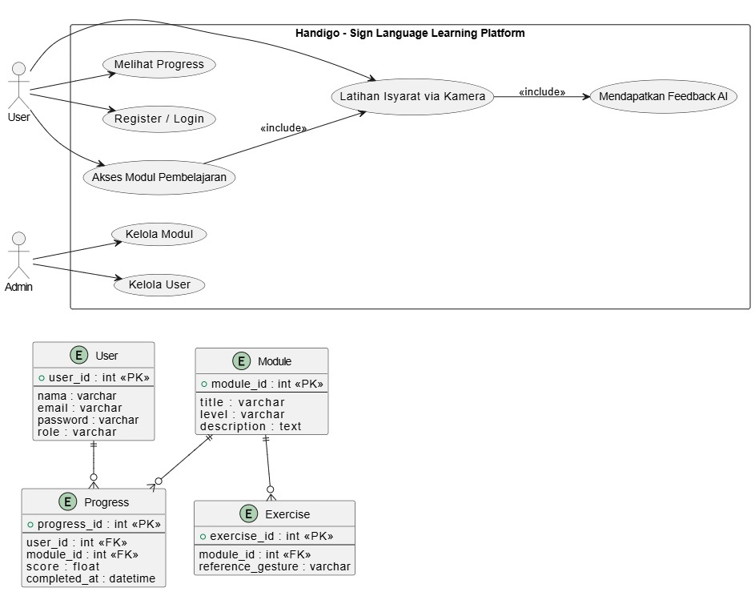
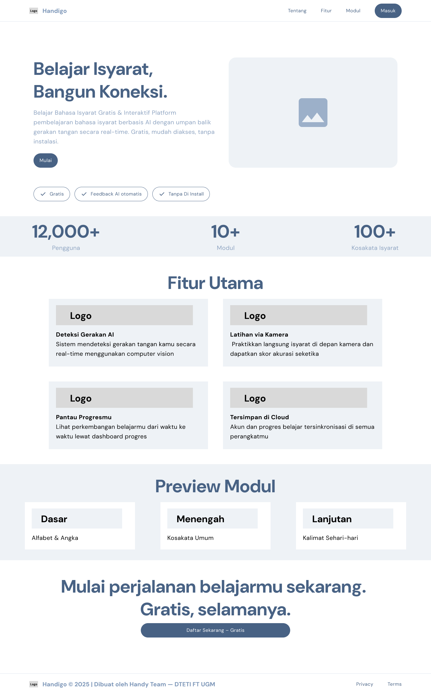
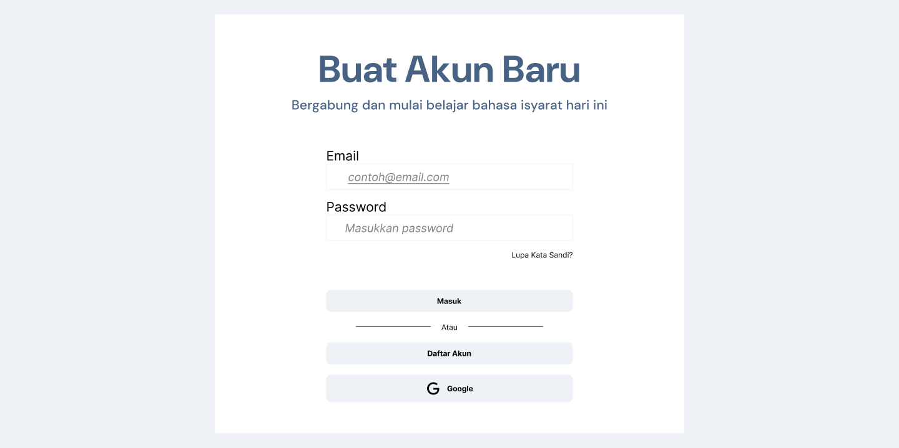
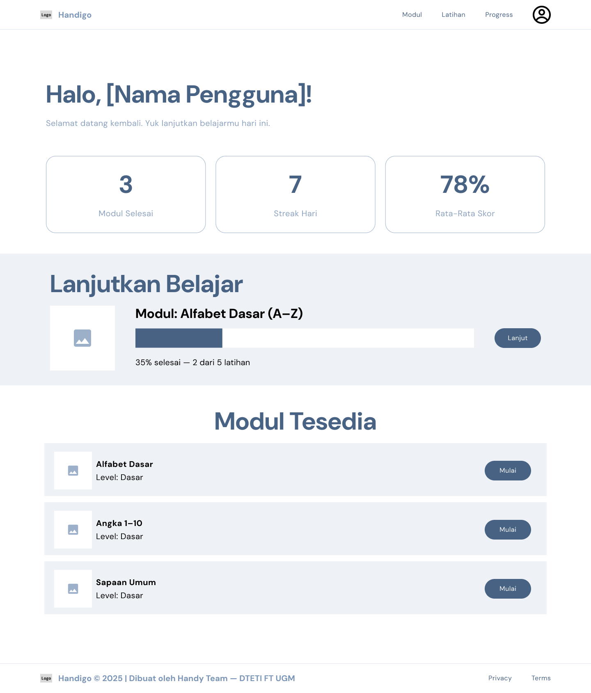

# SENIOR PROJECT TI

## Project Senior Project TI

---

## 👥 Nama Kelompok

**Handy Team**

---

## 🧑‍💻 Anggota dan NIM Kelompok

| Nama                        | NIM                 | Peran    |
| --------------------------- | ------------------- | -------- |
| Fanny Elisabeth             | 23/518300/TK/57035  | PM, CE   |
| Warda Saniia Fawahaana      | 23/518824/TK/57170  | SE       |
| Muhammad Mulat Adi Wardhana | 23/522856/TK/522856 | UXD, AIE |

---

## 🏛 Instansi

**Departemen Teknologi Elektro dan Teknologi Informasi**  
**Fakultas Teknik**  
**Universitas Gadjah Mada**

---

# 📘 Modul 1 – Perumusan Masalah

---

## 🏷 Nama Produk

**Handigo**

---

## 📦 Jenis Produk

Platform web pembelajaran bahasa isyarat berbasis AI (Computer Vision) dengan pendekatan SaaS berbasis Cloud.

---

## 📚 Latar Belakang & Permasalahan

Bahasa isyarat merupakan sarana komunikasi utama bagi penyandang tunarungu. Berdasarkan data WHO, sekitar 1,5 miliar orang di dunia mengalami gangguan pendengaran, sehingga kebutuhan akan pembelajaran bahasa isyarat menjadi semakin penting.

Di Indonesia, minat masyarakat untuk mempelajari bahasa isyarat mulai meningkat seiring dorongan inklusivitas, namun akses pembelajaran masih terbatas.

Saat ini, sebagian besar platform pembelajaran bahasa isyarat hanya menyediakan video atau modul tutorial statis, sehingga pengguna tidak memperoleh umpan balik langsung terhadap gerakan tangan yang dipraktikkan.

Beberapa platform juga bersifat berbayar dan kurang praktikal untuk pembelajaran mandiri.

### Rumusan Permasalahan

1. Bagaimana membuat platform pembelajaran bahasa isyarat yang gratis dan mudah diakses?
2. Bagaimana menyediakan sistem pembelajaran yang lebih praktis dibanding platform yang sudah ada?
3. Bagaimana menghadirkan modul interaktif dengan umpan balik otomatis berbasis AI?

---

## 💡 Ide Solusi

Handigo dikembangkan sebagai platform pembelajaran bahasa isyarat berbasis web yang:

- Gratis dan dapat diakses melalui internet
- Menggunakan teknologi Computer Vision untuk mendeteksi gerakan tangan secara real-time
- Memberikan feedback otomatis berbasis AI
- Menyimpan progres pengguna melalui sistem cloud

### Teknologi yang Digunakan

| Teknologi       | Keterangan                                               |
| --------------- | -------------------------------------------------------- |
| Computer Vision | Mendeteksi dan mengenali bahasa isyarat secara real-time |
| Cloud Computing | Menyimpan progres dan data pengguna                      |
| SaaS Model      | Model AI dijalankan melalui layanan cloud                |

---

## ⭐ Rancangan Fitur

1. **Modul Pembelajaran Bahasa Isyarat**  
   Materi berbentuk video dan penjelasan berdasarkan level.

2. **Deteksi Gerakan Tangan (AI)**  
   Sistem mengenali gerakan melalui kamera pengguna.

3. **Latihan Interaktif**  
   Pengguna dapat langsung mempraktikkan isyarat.

4. **Feedback & Skor Akurasi**  
   Sistem memberikan penilaian benar/salah atau skor.

5. **Progress Tracking**  
   Menampilkan perkembangan belajar pengguna.

---

# 🔎 Analisis Kompetitor

## 1️⃣ Signlingo

**Jenis:** Direct Competitor  
**Produk:** Aplikasi pembelajaran bahasa isyarat dengan materi dan kuis.

**Kelebihan:**

- Materi terstruktur
- Gamifikasi (reward & badges)

**Kekurangan:**

- Tidak menekankan evaluasi gerakan berbasis computer vision secara real-time

---

## 2️⃣ Duolingo

**Jenis:** Indirect Competitor  
**Produk:** Aplikasi pembelajaran bahasa berbasis gamifikasi.

**Kelebihan:**

- Gamifikasi kuat
- Platform global
- Materi terstruktur

**Kekurangan:**

- Tidak menyediakan pembelajaran bahasa isyarat
- Tidak ada evaluasi gerakan tangan berbasis AI

---

## 3️⃣ Lingvano

**Jenis:** Direct/Indirect Competitor  
**Produk:** Aplikasi mobile belajar ASL berbasis video.

**Kelebihan:**

- Video dari guru tunarungu
- Cocok untuk pemula

**Kekurangan:**

- Tidak memiliki AI computer vision untuk evaluasi otomatis

---

# 🎯 Unique Value Proposition

Handigo menghadirkan pembelajaran bahasa isyarat yang:

- Gratis & mudah diakses
- Interaktif dengan AI real-time feedback
- Berbasis cloud dan scalable
- Menggabungkan pembelajaran + evaluasi otomatis

---

# 📘 Modul 2 – Perancangan Sistem (SDLC)

---

## 1️⃣ Metodologi SDLC yang Dipilih

### Metodologi: **Agile (Scrum-Based Iterative Development)**

### Alasan Pemilihan:

1. Proyek berbasis AI & Computer Vision → butuh iterasi dan eksperimen model.
2. Requirement bisa berkembang setelah uji coba awal.
3. Feedback pengguna penting untuk peningkatan akurasi sistem.
4. Timeline 1 semester cocok untuk sprint 2-mingguan.

### Skema Sprint:

- Sprint 1–2 → Requirement & Design
- Sprint 3–5 → Development Core Feature
- Sprint 6 → Testing & Deployment

---

# 2️⃣ Tahap 1–3 SDLC

---

## a. Tujuan Produk

Handigo bertujuan untuk:

- Menyediakan platform pembelajaran bahasa isyarat yang gratis dan inklusif.
- Memberikan umpan balik otomatis berbasis AI terhadap gerakan tangan.
- Meningkatkan efektivitas pembelajaran melalui interaktivitas.

---

## b. Pengguna Potensial & Kebutuhan

### 🎯 Pengguna Potensial:

1. Mahasiswa & pelajar
2. Masyarakat umum
3. Keluarga penyandang tunarungu
4. Relawan & tenaga pengajar inklusi

### 🧩 Kebutuhan Pengguna:

| Pengguna          | Kebutuhan                       |
| ----------------- | ------------------------------- |
| Pemula            | Materi dasar & mudah dipahami   |
| Pengguna lanjutan | Evaluasi akurasi gerakan        |
| Semua pengguna    | Platform gratis & mudah diakses |
| Pengajar          | Monitoring progres siswa        |

---

## c. Use Case Diagram

Berikut rancangan use case utama:

### Aktor:

- User
- Admin

### Use Case Utama:

- Register / Login
- Akses Modul Pembelajaran
- Latihan Isyarat via Kamera
- Mendapatkan Feedback AI
- Melihat Progress
- Admin mengelola modul

---

## d. Functional Requirements

### 1. Authentication

- Sistem harus memungkinkan user registrasi dan login.
- Sistem menyimpan data akun di cloud database.

### 2. Modul Pembelajaran

- Sistem menampilkan modul berdasarkan level.
- Sistem menyimpan progres penyelesaian modul.

### 3. AI Detection

- Sistem mengakses kamera pengguna.
- Sistem mendeteksi gerakan tangan real-time.
- Sistem menghitung akurasi gerakan.

### 4. Feedback System

- Sistem menampilkan skor akurasi.
- Sistem memberikan indikator benar/salah.

### 5. Progress Tracking

- Sistem menyimpan histori latihan.
- Sistem menampilkan statistik performa.

---

## e. Entity Relationship Diagram (ERD)

### Entitas Utama:

**User**

- user_id (PK)
- nama
- email
- password
- role

**Module**

- module_id (PK)
- title
- level
- description

**Progress**

- progress_id (PK)
- user_id (FK)
- module_id (FK)
- score
- completed_at

**Exercise**

- exercise_id (PK)
- module_id (FK)
- reference_gesture

---

## f. Low-Fidelity Wireframe

- Hero Page
  
- Login Page
  
- Dashboard Page
  
- Detail Modul Page
  
- Latihan AI Page
  

### Halaman Utama:

- Header (Logo + Login)
- Hero Section
- Daftar Modul
- CTA Mulai Belajar

### Halaman Latihan:

- Camera View
- Reference Gesture
- Skor Akurasi
- Tombol Ulangi

---

## g. Gantt Chart (1 Semester – 16 Minggu)

| Minggu | Aktivitas             |
| ------ | --------------------- |
| 1–2    | Planning dan Analisis |
| 2–4    | System design         |
| 3-8    | Development           |
| 7–10   | Testing dan Integrasi |
| 10–12  | Deployment            |

---

# 🎯 Ringkasan

Metodologi Agile dipilih karena fleksibel untuk pengembangan AI.
Tahapan SDLC telah mencakup perencanaan, analisis, dan perancangan sistem secara komprehensif untuk mendukung pengembangan Handigo dalam satu semester.

---

© 2026 Handy Team – Senior Project TI
